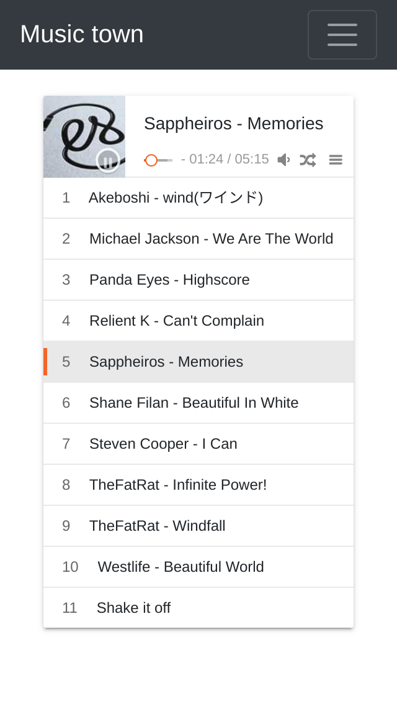

# This is a music place built on Flask.

### Usage
#### Env
conda or pip

```
pip install flask==0.12
```

> This is a 2016 year project.

#### For linux
`python3 app/app.py 'your_music_folder_path'`

#### For windows
`python3 app/app.py`

### Screenshot


### Todo
Maybe add a static amd32 ffmpeg program for linux.
